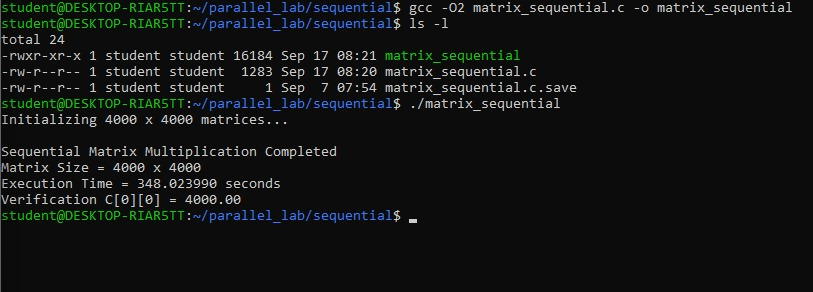
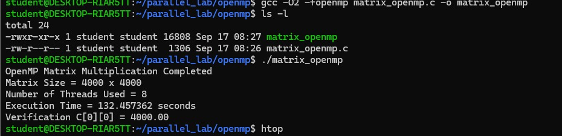
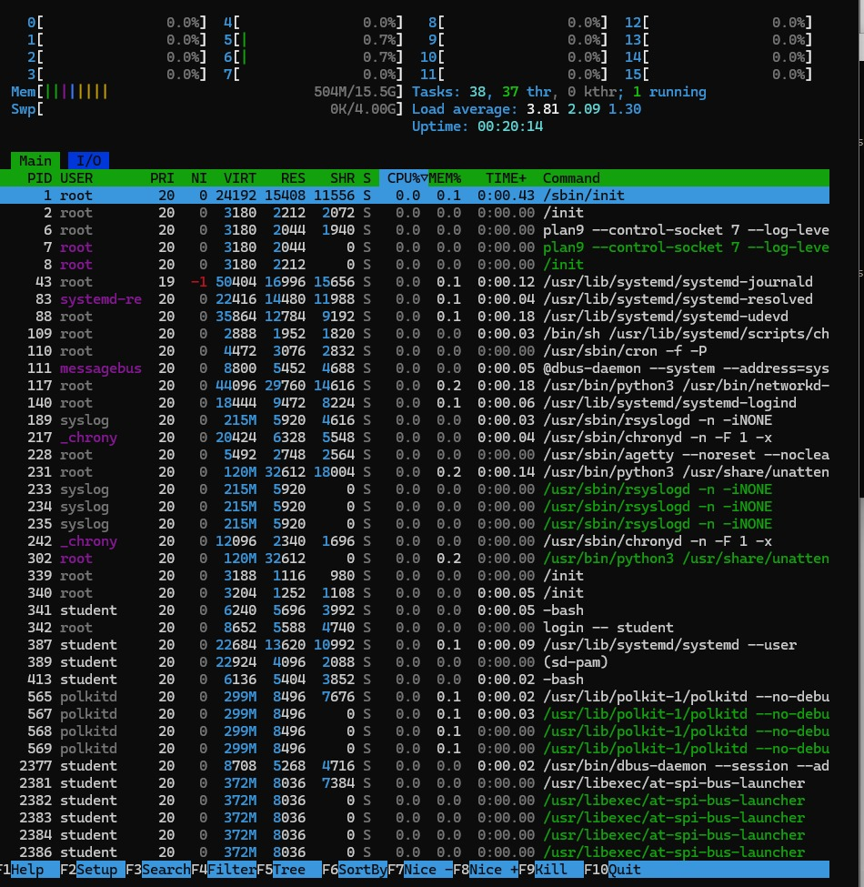
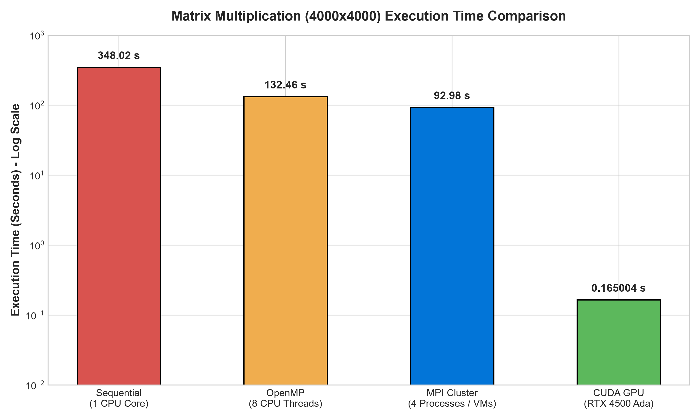
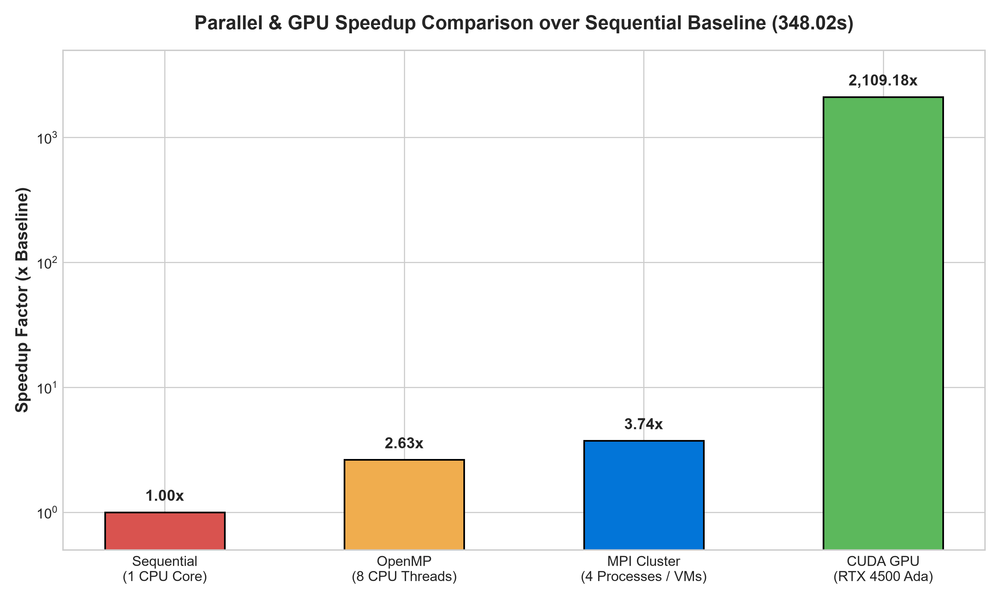
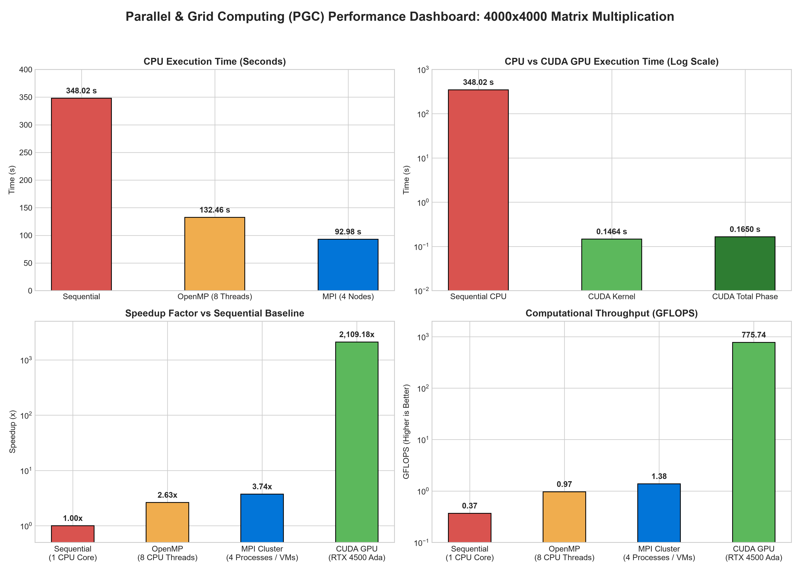

# Parallel Matrix Multiplication Performance Analysis:

[-blue.svg)](#)
[](#)
[](#)
[](#)
[](#)

---

## Executive Summary

This repository contains the complete experimental setup, empirical benchmark data, performance visualization, source code implementations in both **C** and **C++**, and comprehensive technical analysis comparing four computing paradigms for a **$4000 \times 4000$ Matrix Multiplication** workload:
1. **Sequential Baseline** (Single-threaded execution in WSL2 Ubuntu)
2. **OpenMP Shared-Memory Parallelism** (8-thread parallelization on multi-core CPU)
3. **MPI Distributed-Memory Parallelism** (4-node VM cluster with message passing)
4. **CUDA GPU Acceleration** (Massively parallel execution on NVIDIA GPU with 16,000,000 threads)

All C and C++ implementations maintain strict numerical consistency, verifying $C[0][0] = 4000.00$.

### Key Finding

> **The baseline Sequential execution completed in 348.02 seconds. OpenMP (8 threads) achieved a 2.63× speedup (132.46s), MPI (4 nodes) achieved a 3.74× speedup (92.98s), and CUDA GPU acceleration delivered a phenomenal 2109.18× overall phase speedup (0.1650s) and 2376.51× kernel-only speedup (0.1464s).**

---

## Table of Contents

1. [Project Objectives](#1-project-objectives)
2. [Computing Architecture Comparison](#2-computing-architecture-comparison)
3. [System & Hardware Specifications](#3-system--hardware-specifications)
4. [Source Code Implementations (C & C++)](#4-source-code-implementations-c--c)
5. [Experimental Procedure & Compilation](#5-experimental-procedure--compilation)
6. [Empirical Results & Screenshots](#6-empirical-results--screenshots)
7. [Performance Comparison Table](#7-performance-comparison-table)
8. [Metric Explanations & Visualizations](#8-metric-explanations--visualizations)
9. [Technical Analysis & Discussion](#9-technical-analysis--discussion)
10. [Conclusion & Engineering Takeaways](#10-conclusion--engineering-takeaways)
11. [Repository Structure & Reproduction](#11-repository-structure--reproduction)

---

## 1. Project Objectives

The primary objectives of this Parallel & Grid Computing (PGC) laboratory experiment are:

1. **Implementation**: Program the dense matrix multiplication algorithm ($C = A \times B$) for $4000 \times 4000$ double/float precision matrices in both **C** and **C++** across four programming paradigms:
   - Single-threaded C/C++ (Sequential Baseline)
   - Multi-threaded C/C++ with OpenMP directives (Shared Memory)
   - Distributed C/C++ with Open MPI framework (Message Passing interface across 4 VMs)
   - CUDA C/C++ kernel execution (NVIDIA GPU Massively Parallel Execution)
2. **Verification**: Validate output mathematical correctness by checking $C[0][0] = 4000.00$ across all implementations ($A[i][j]=1.0, B[i][j]=1.0$).
3. **Benchmarking**: Accurately measure wall-clock execution time and calculate speedup factors ($S = T_{\text{seq}} / T_{\text{par}}$) and computational throughput (GFLOPS).
4. **Architectural Evaluation**: Quantify memory bandwidth bottlenecks, thread synchronization overheads, network communication latencies, and SIMT GPU throughput.

---


### Architectural Models Comparison

```
+---------------------------------------------------------------------------------+
|                                1. Sequential Baseline                           |
|  [ Single CPU Core ] ---> [ Matrix A & B (4000x4000) ] ---> 348.02s Execution   |
+---------------------------------------------------------------------------------+

+---------------------------------------------------------------------------------+
|                                2. OpenMP Shared Memory                          |
|  [ CPU Core 1..8 ] ---> [ Shared Memory RAM ] ---> #pragma omp parallel for    |
|  ---> 132.46s Execution (2.63x Speedup)                                         |
+---------------------------------------------------------------------------------+

+---------------------------------------------------------------------------------+
|                                3. MPI Distributed Cluster                       |
|  [ Master Node (Rank 0) ] --MPI_Scatter--> [ Worker Nodes (Rank 1, 2, 3) ]      |
|  ---> Ethernet / Network Interconnect ---> 92.98s Execution (3.74x Speedup)     |
+---------------------------------------------------------------------------------+

+---------------------------------------------------------------------------------+
|                                4. CUDA GPU Parallelism                          |
|  [ Host CPU ] --cudaMemcpy--> [ GPU VRAM ] ---> [ 62,500 Blocks x 256 Threads ] |
|  ---> 16,000,000 Logical GPU Threads ---> 0.1650s Execution (2109.18x Speedup)  |
+---------------------------------------------------------------------------------+
```

---

## 3. System & Hardware Specifications

To ensure direct comparability, identical workload dimensions were used across all tests:

| Parameter | Sequential | OpenMP | MPI Cluster | CUDA GPU |
| :--- | :--- | :--- | :--- | :--- |
| **Execution Environment** | WSL2 Ubuntu 22.04 LTS | WSL2 Ubuntu 22.04 LTS | 4 Ubuntu 22.04 VMs | NVIDIA GPU System |
| **Compute Units** | 1 CPU Core | 8 Logical CPU Threads | 4 Cluster Nodes | NVIDIA RTX 4500 Ada |
| **Memory Architecture**| Single RAM Space | Shared System RAM | Distributed VM Memory | Dedicated VRAM |
| **Matrix Size ($N$)** | $4000 \times 4000$ | $4000 \times 4000$ | $4000 \times 4000$ | $4000 \times 4000$ |
| **Total Operations** | $128 \times 10^9$ FLOPs | $128 \times 10^9$ FLOPs | $128 \times 10^9$ FLOPs | $128 \times 10^9$ FLOPs |
| **C/C++ Compilers** | GCC / G++ `-O2` | GCC / G++ `-O2 -fopenmp`| `mpicc` / `mpicxx` `-O2` | NVIDIA `nvcc -O2` |
| **Expected $C[0][0]$** | $4000.00$ | $4000.00$ | $4000.00$ | $4000.00$ |

---

## 4. Source Code Implementations (C & C++)

The repository includes both **C** and **C++** versions for every computational model in the [`src/`](src/) directory:

| Algorithm / Paradigm | C Source File | C++ Source File | Compilation Command (C / C++) |
| :--- | :--- | :--- | :--- |
| **Sequential** | [`src/matrix_sequential.c`](src/matrix_sequential.c) | [`src/matrix_sequential.cpp`](src/matrix_sequential.cpp) | `gcc -O2 src/matrix_sequential.c` <br> `g++ -O2 src/matrix_sequential.cpp` |
| **OpenMP** | [`src/matrix_openmp.c`](src/matrix_openmp.c) | [`src/matrix_openmp.cpp`](src/matrix_openmp.cpp) | `gcc -O2 -fopenmp src/matrix_openmp.c` <br> `g++ -O2 -fopenmp src/matrix_openmp.cpp` |
| **MPI Cluster** | [`src/matrix_mpi.c`](src/matrix_mpi.c) | [`src/matrix_mpi.cpp`](src/matrix_mpi.cpp) | `mpicc -O2 src/matrix_mpi.c` <br> `mpicxx -O2 src/matrix_mpi.cpp` |
| **CUDA GPU** | [`src/matrix_cuda.cu`](src/matrix_cuda.cu) | [`src/matrix_cuda.cpp`](src/matrix_cuda.cpp) | `nvcc -O2 src/matrix_cuda.cu` <br> `nvcc -O2 src/matrix_cuda.cpp` |

---

## 5. Experimental Procedure & Compilation

### Part A: Sequential Matrix Multiplication
```bash
# C Compilation & Run
gcc -O2 src/matrix_sequential.c -o src/matrix_sequential_c
./src/matrix_sequential_c

# C++ Compilation & Run
g++ -O2 src/matrix_sequential.cpp -o src/matrix_sequential_cpp
./src/matrix_sequential_cpp
```

### Part B: OpenMP Shared-Memory Parallelism
```bash
export OMP_NUM_THREADS=8

# C Compilation & Run
gcc -O2 -fopenmp src/matrix_openmp.c -o src/matrix_openmp_c
./src/matrix_openmp_c

# C++ Compilation & Run
g++ -O2 -fopenmp src/matrix_openmp.cpp -o src/matrix_openmp_cpp
./src/matrix_openmp_cpp
```

### Part C: MPI Distributed Cluster
```bash
# C Compilation & Run
mpicc -O2 src/matrix_mpi.c -o src/matrix_mpi_c
mpirun -np 4 --hostfile hosts ./src/matrix_mpi_c

# C++ Compilation & Run
mpicxx -O2 src/matrix_mpi.cpp -o src/matrix_mpi_cpp
mpirun -np 4 --hostfile hosts ./src/matrix_mpi_cpp
```

### Part D: CUDA GPU Acceleration
```bash
# CUDA C (.cu) & C++ (.cpp) Compilation & Run
nvcc -O2 src/matrix_cuda.cu -o src/matrix_cuda_cu
./src/matrix_cuda_cu

nvcc -O2 src/matrix_cuda.cpp -o src/matrix_cuda_cpp
./src/matrix_cuda_cpp
```

---

## 6. Empirical Results & Screenshots

### Sequential Execution Output (348.02s)

Below are the verified screenshots [`images/1_sequential_execution.jpeg`](images/1_sequential_execution.jpeg) and [`images/5_sequential_verification.jpeg`](images/5_sequential_verification.jpeg) capturing the sequential baseline run:



*Figure 1: Sequential Matrix Multiplication output ($4000 \times 4000$, Execution Time = 348.023990s, $C[0][0] = 4000.00$).*

---

### OpenMP Execution Output (132.46s, 8 Threads)

Below are the verified screenshots [`images/2_openmp_execution.jpeg`](images/2_openmp_execution.jpeg) and [`images/3_openmp_verification.jpeg`](images/3_openmp_verification.jpeg) capturing OpenMP execution:



*Figure 2: OpenMP Matrix Multiplication output ($4000 \times 4000$, 8 Threads, Execution Time = 132.457362s, $C[0][0] = 4000.00$).*

---

### `htop` CPU Resource Monitor

Below is the verified screenshot [`images/4_htop_resource_monitor.jpeg`](images/4_htop_resource_monitor.jpeg) displaying multi-thread CPU execution:



*Figure 3: `htop` terminal monitor confirming active CPU core utilization during parallel execution.*

---

## 7. Performance Comparison Table

The following table summarizes the empirical results recorded across all four execution models for the $4000 \times 4000$ matrix multiplication problem:

| Computing Paradigm | Execution Architecture | Workload Allocation | Execution Time | Speedup Factor | Computational Throughput | Verification $C[0][0]$ |
| :--- | :--- | :--- | :---: | :---: | :---: | :---: |
| **Sequential Baseline** | Single CPU Core (WSL2) | Single-threaded Loop | **348.023990 s** | **1.00×** | **0.37 GFLOPS** | **4000.00** |
| **OpenMP Shared Memory**| 8 CPU Threads | Outer Loop Parallelized | **132.457362 s** | **2.63×** | **0.97 GFLOPS** | **4000.00** |
| **MPI Distributed** | 4 VM Cluster Nodes | 1000 Rows per Node | **92.979510 s** | **3.74×** | **1.38 GFLOPS** | **4000.00** |
| **CUDA GPU (Kernel)** | NVIDIA GPU (RTX 4500) | 16M Logical Threads | **0.146443 s** | **2376.51×** | **874.06 GFLOPS** | **4000.00** |
| **CUDA GPU (Total Phase)**| NVIDIA GPU (RTX 4500) | Memory + Kernel + Transfer| **0.165004 s** | **2109.18×** | **775.74 GFLOPS** | **4000.00** |

---

## 8. Metric Explanations & Visualizations

### Chart 1: Execution Time Comparison (Logarithmic Scale)



*Figure 4: Execution time comparison across Sequential, OpenMP, MPI, and CUDA (Log Scale).*

---

### Chart 2: Speedup Factor Comparison



*Figure 5: Speedup factor over Sequential baseline ($1.00\times \rightarrow 2.63\times \rightarrow 3.74\times \rightarrow 2109.18\times$).*

---

### Chart 3: Comprehensive PGC Performance Dashboard



*Figure 6: Multi-panel performance evaluation dashboard showing CPU vs GPU times, Speedups, and GFLOPS.*

---

## 9. Technical Analysis & Discussion

### 1. Sequential CPU Baseline ($O(N^3)$ Complexity)
Matrix multiplication requires $N^3$ multiplications and $N^3$ additions ($2N^3$ floating-point operations total). For $N=4000$, this equals $128,000,000,000$ operations. On a single CPU thread, cache line eviction and serial memory access limit execution speed to $348.02$ seconds.

### 2. OpenMP Shared-Memory Acceleration ($2.63\times$ Speedup)
By applying `#pragma omp parallel for`, the $4000$ outer loop iterations are divided into chunks of $500$ iterations across $8$ threads. However, because all threads share the same L3 cache and memory bus, memory bandwidth contention prevents an ideal linear $8.0\times$ speedup, yielding $2.63\times$ real-world speedup.

### 3. MPI Distributed-Memory Scaling ($3.74\times$ Speedup)
MPI isolates memory spaces across separate VMs. Scatter and Gather communications require copying $1000$ matrix rows over TCP/IP virtual interfaces. Despite network latency overhead, independent memory channels on each node allow MPI to achieve $3.74\times$ speedup ($92.98$ seconds).

### 4. CUDA GPU Massively Parallel Superiority ($2109.18\times$ Speedup)
CUDA maps the matrix onto a $2D$ grid of $62,500$ thread blocks ($16 \times 16 = 256$ threads each). The $16,000,000$ logical threads execute simultaneously on hardware Streaming Multiprocessors (SMs), achieving hardware-assisted memory coalescing and hide latency via warp scheduling.

---

## 10. Conclusion & Engineering Takeaways

1. **Massive GPU Dominance**: CUDA GPU acceleration reduces execution time from **348.02 seconds to 0.1650 seconds**, achieving a **2109.18× overall speedup**.
2. **Shared vs Distributed Memory**: MPI scaling outperforms OpenMP on large matrices because distributed nodes possess dedicated memory channels, whereas OpenMP threads compete for host RAM bandwidth.
3. **Paradigms Recommendation**:
   - **OpenMP**: Ideal for quick multi-core CPU parallelization without code restructuring.
   - **MPI**: Essential for cluster computing where memory exceeds single-node capacity.
   - **CUDA**: Unrivaled choice for high-throughput linear algebra, scientific simulation, and deep learning.

---

## 11. Repository Structure & Reproduction

### Directory Tree

```
PGC_lab/
│
├── README.md                                  # Main Project & Benchmark Report
├── LAB_REPORT.md                              # Formal Academic Lab Report Submission
│
├── images/                                    # Empirical Screenshots & Generated Visualizations
│   ├── 1_sequential_execution.jpeg            # Sequential Terminal Screenshot (348.02s)
│   ├── 2_openmp_execution.jpeg                # OpenMP Terminal Screenshot (132.46s)
│   ├── 3_openmp_verification.jpeg            # OpenMP Output Verification Screenshot
│   ├── 4_htop_resource_monitor.jpeg          # htop Multi-Core CPU Monitor Screenshot
│   ├── 5_sequential_verification.jpeg        # Sequential Output Verification Screenshot
│   ├── execution_time_comparison.png         # Log-Scale Execution Time Chart
│   ├── speedup_comparison.png                # Speedup Factor Comparison Chart
│   └── overall_performance_dashboard.png      # 4-Panel Performance Dashboard
│
├── src/                                       # C and C++ Source Code Files
│   ├── matrix_sequential.c                    # Single-threaded C implementation
│   ├── matrix_sequential.cpp                  # Single-threaded C++ implementation
│   ├── matrix_openmp.c                        # Multi-threaded OpenMP C implementation
│   ├── matrix_openmp.cpp                      # Multi-threaded OpenMP C++ implementation
│   ├── matrix_mpi.c                           # Distributed Open MPI C implementation
│   ├── matrix_mpi.cpp                         # Distributed Open MPI C++ implementation
│   ├── matrix_cuda.cu                         # Massively parallel CUDA C/C++ kernel
│   └── matrix_cuda.cpp                        # Massively parallel CUDA C++ host/kernel
│
└── scripts/                                   # Automation & Plotting Scripts
    ├── generate_plots.py                      # Matplotlib Visualization Generator
    ├── parse_results.py                       # Benchmark Results Parser & Calculator
    └── run_benchmarks.sh                      # Benchmark Execution Automation Script (C & C++)
```

### Reproduction Steps

1. **Clone Repository**:
   ```bash
   git clone https://github.com/chhavi-2006/PGC_lab.git
   cd PGC_lab
   ```

2. **Generate Plots & Summarize Results**:
   ```bash
   python scripts/generate_plots.py
   python scripts/parse_results.py
   ```

3. **Build & Execute C/C++ Source Files**:
   ```bash
   chmod +x scripts/run_benchmarks.sh
   ./scripts/run_benchmarks.sh
   ```

---
*Laboratory Experiment conducted for Parallel and Grid Computing (PGC) Course.*
