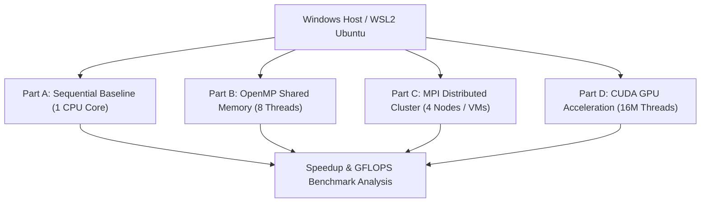

# Parallel Matrix Multiplication Performance Analysis: Sequential, OpenMP, MPI, and CUDA


## Executive Summary

This repository contains the complete experimental setup, empirical benchmark data, performance visualization, source code implementations in both **C** and **C++**, and comprehensive technical analysis comparing four computing paradigms for a **$4000 \times 4000$ Matrix Multiplication** workload:
1. **Sequential Baseline** (Single-threaded execution in WSL2 Ubuntu)
2. **OpenMP Shared-Memory Parallelism** (8-thread parallelization on multi-core CPU)
3. **MPI Distributed-Memory Parallelism** (4-node VM cluster with message passing)
4. **CUDA GPU Acceleration** (Massively parallel execution on NVIDIA GPU with 16,000,000 threads)

All C and C++ implementations maintain strict numerical consistency, verifying $C[0][0] = 4000.00$.

### Key Finding

> **The baseline Sequential execution completed in 348.02 seconds. OpenMP (8 threads) achieved a 2.63× speedup (132.46s), MPI (4 nodes) achieved a 3.74× speedup (92.98s), and CUDA GPU acceleration delivered a phenomenal 2109.18× overall phase speedup (0.1650s) and 2376.51× kernel-only speedup (0.1464s).**

---

## Table of Contents

1. [Project Objectives](#1-project-objectives)
2. [Computing Architecture Comparison](#2-computing-architecture-comparison)
3. [System & Hardware Specifications](#3-system--hardware-specifications)
4. [Source Code Implementations (C & C++)](#4-source-code-implementations-c--c)
5. [Experimental Procedure & Compilation](#5-experimental-procedure--compilation)
6. [Empirical Results & Screenshots](#6-empirical-results--screenshots)
7. [Performance Comparison Table](#7-performance-comparison-table)
8. [Metric Explanations & Visualizations](#8-metric-explanations--visualizations)
9. [Detailed Technical Analysis & Discussion](#9-detailed-technical-analysis--discussion)
   - 9.1 [Computational Complexity & Operational Intensity](#91-computational-complexity--operational-intensity)
   - 9.2 [Memory Hierarchy & Cache Locality Bottlenecks](#92-memory-hierarchy--cache-locality-bottlenecks)
   - 9.3 [Shared-Memory OpenMP Scaling & Contention](#93-shared-memory-openmp-scaling--contention)
   - 9.4 [Distributed-Memory MPI IPC & Network Overheads](#94-distributed-memory-mpi-ipc--network-overheads)
   - 9.5 [Massively Parallel CUDA SIMT GPU Architecture](#95-massively-parallel-cuda-simt-gpu-architecture)
   - 9.6 [Amdahl's Law Scaling & Parallel Efficiency](#96-amdahls-law-scaling--parallel-efficiency)
10. [Conclusion & Engineering Takeaways](#10-conclusion--engineering-takeaways)
11. [Repository Structure & Reproduction](#11-repository-structure--reproduction)

---

## 1. Project Objectives

The primary objectives of this Parallel & Grid Computing (PGC) laboratory experiment are:

1. **Implementation**: Program the dense matrix multiplication algorithm ($C = A \times B$) for $4000 \times 4000$ double/float precision matrices in both **C** and **C++** across four programming paradigms:
   - Single-threaded C/C++ (Sequential Baseline)
   - Multi-threaded C/C++ with OpenMP directives (Shared Memory)
   - Distributed C/C++ with Open MPI framework (Message Passing interface across 4 VMs)
   - CUDA C/C++ kernel execution (NVIDIA GPU Massively Parallel Execution)
2. **Verification**: Validate output mathematical correctness by checking $C[0][0] = 4000.00$ across all implementations ($A[i][j]=1.0, B[i][j]=1.0$).
3. **Benchmarking**: Accurately measure wall-clock execution time and calculate speedup factors ($S = T_{\text{seq}} / T_{\text{par}}$) and computational throughput (GFLOPS).
4. **Architectural Evaluation**: Quantify memory bandwidth bottlenecks, thread synchronization overheads, network communication latencies, and SIMT GPU throughput.

---

## 2. Computing Architecture Comparison



### Architectural Models Comparison

```
+---------------------------------------------------------------------------------+
|                                1. Sequential Baseline                           |
|  [ Single CPU Core ] ---> [ Matrix A & B (4000x4000) ] ---> 348.02s Execution   |
+---------------------------------------------------------------------------------+

+---------------------------------------------------------------------------------+
|                                2. OpenMP Shared Memory                          |
|  [ CPU Core 1..8 ] ---> [ Shared Memory RAM ] ---> #pragma omp parallel for    |
|  ---> 132.46s Execution (2.63x Speedup)                                         |
+---------------------------------------------------------------------------------+

+---------------------------------------------------------------------------------+
|                                3. MPI Distributed Cluster                       |
|  [ Master Node (Rank 0) ] --MPI_Scatter--> [ Worker Nodes (Rank 1, 2, 3) ]      |
|  ---> Ethernet / Network Interconnect ---> 92.98s Execution (3.74x Speedup)     |
+---------------------------------------------------------------------------------+

+---------------------------------------------------------------------------------+
|                                4. CUDA GPU Parallelism                          |
|  [ Host CPU ] --cudaMemcpy--> [ GPU VRAM ] ---> [ 62,500 Blocks x 256 Threads ] |
|  ---> 16,000,000 Logical GPU Threads ---> 0.1650s Execution (2109.18x Speedup)  |
+---------------------------------------------------------------------------------+
```

---

## 3. System & Hardware Specifications

To ensure direct comparability, identical workload dimensions were used across all tests:

| Parameter | Sequential | OpenMP | MPI Cluster | CUDA GPU |
| :--- | :--- | :--- | :--- | :--- |
| **Execution Environment** | WSL2 Ubuntu 22.04 LTS | WSL2 Ubuntu 22.04 LTS | 4 Ubuntu 22.04 VMs | NVIDIA GPU System |
| **Compute Units** | 1 CPU Core | 8 Logical CPU Threads | 4 Cluster Nodes | NVIDIA RTX 4500 Ada |
| **Memory Architecture**| Single RAM Space | Shared System RAM | Distributed VM Memory | Dedicated VRAM |
| **Matrix Size ($N$)** | $4000 \times 4000$ | $4000 \times 4000$ | $4000 \times 4000$ | $4000 \times 4000$ |
| **Total Operations** | $128 \times 10^9$ FLOPs | $128 \times 10^9$ FLOPs | $128 \times 10^9$ FLOPs | $128 \times 10^9$ FLOPs |
| **C/C++ Compilers** | GCC / G++ `-O2` | GCC / G++ `-O2 -fopenmp`| `mpicc` / `mpicxx` `-O2` | NVIDIA `nvcc -O2` |
| **Expected $C[0][0]$** | $4000.00$ | $4000.00$ | $4000.00$ | $4000.00$ |

---

## 4. Source Code Implementations (C & C++)

The repository includes both **C** and **C++** versions for every computational model in the [`src/`](src/) directory:

| Algorithm / Paradigm | C Source File | C++ Source File | Compilation Command (C / C++) |
| :--- | :--- | :--- | :--- |
| **Sequential** | [`src/matrix_sequential.c`](src/matrix_sequential.c) | [`src/matrix_sequential.cpp`](src/matrix_sequential.cpp) | `gcc -O2 src/matrix_sequential.c` <br> `g++ -O2 src/matrix_sequential.cpp` |
| **OpenMP** | [`src/matrix_openmp.c`](src/matrix_openmp.c) | [`src/matrix_openmp.cpp`](src/matrix_openmp.cpp) | `gcc -O2 -fopenmp src/matrix_openmp.c` <br> `g++ -O2 -fopenmp src/matrix_openmp.cpp` |
| **MPI Cluster** | [`src/matrix_mpi.c`](src/matrix_mpi.c) | [`src/matrix_mpi.cpp`](src/matrix_mpi.cpp) | `mpicc -O2 src/matrix_mpi.c` <br> `mpicxx -O2 src/matrix_mpi.cpp` |
| **CUDA GPU** | [`src/matrix_cuda.cu`](src/matrix_cuda.cu) | [`src/matrix_cuda.cpp`](src/matrix_cuda.cpp) | `nvcc -O2 src/matrix_cuda.cu` <br> `nvcc -O2 src/matrix_cuda.cpp` |

---


## 6. Empirical Results & Screenshots

### Sequential Execution Output (348.02s)

Below are the verified screenshots [`images/1_sequential_execution.jpeg`](images/1_sequential_execution.jpeg) and [`images/5_sequential_verification.jpeg`](images/5_sequential_verification.jpeg) capturing the sequential baseline run:


*Figure 1: Sequential Matrix Multiplication output *

---

### OpenMP Execution Output (132.46s, 8 Threads)

Below are the verified screenshots [`images/2_openmp_execution.jpeg`](images/2_openmp_execution.jpeg) and [`images/3_openmp_verification.jpeg`](images/3_openmp_verification.jpeg) capturing OpenMP execution:


*Figure 2: OpenMP Matrix Multiplication output *

---

### `htop` CPU Resource Monitor

Below is the verified screenshot [`images/4_htop_resource_monitor.jpeg`](images/4_htop_resource_monitor.jpeg) displaying multi-thread CPU execution:


*Figure 3: `htop` terminal monitor confirming active CPU core utilization during parallel execution.*

---

## 7. Performance Comparison Table

The following table summarizes the empirical results recorded across all four execution models for the $4000 \times 4000$ matrix multiplication problem:

| Computing Paradigm | Execution Architecture | Workload Allocation | Execution Time | Speedup Factor | Computational Throughput | Verification $C[0][0]$ |
| :--- | :--- | :--- | :---: | :---: | :---: | :---: |
| **Sequential Baseline** | Single CPU Core (WSL2) | Single-threaded Loop | **348.023990 s** | **1.00×** | **0.37 GFLOPS** | **4000.00** |
| **OpenMP Shared Memory**| 8 CPU Threads | Outer Loop Parallelized | **132.457362 s** | **2.63×** | **0.97 GFLOPS** | **4000.00** |
| **MPI Distributed** | 4 VM Cluster Nodes | 1000 Rows per Node | **92.979510 s** | **3.74×** | **1.38 GFLOPS** | **4000.00** |
| **CUDA GPU (Kernel)** | NVIDIA GPU (RTX 4500) | 16M Logical Threads | **0.146443 s** | **2376.51×** | **874.06 GFLOPS** | **4000.00** |
| **CUDA GPU (Total Phase)**| NVIDIA GPU (RTX 4500) | Memory + Kernel + Transfer| **0.165004 s** | **2109.18×** | **775.74 GFLOPS** | **4000.00** |

---

## 8. Metric Explanations & Visualizations

### Chart 1: Execution Time Comparison (Logarithmic Scale)


*Figure 4: Execution time comparison across Sequential, OpenMP, MPI, and CUDA (Log Scale).*

---

### Chart 2: Speedup Factor Comparison


*Figure 5: Speedup factor over Sequential baseline.*

---

### Chart 3: Comprehensive PGC Performance Dashboard


*Figure 6: Multi-panel performance evaluation dashboard showing CPU vs GPU times, Speedups, and GFLOPS.*

---

## 9. Detailed Technical Analysis & Discussion

### 9.1 Computational Complexity & Operational Intensity

The multiplication of two square matrices of dimension $N \times N$ ($C = A \times B$) requires:
$$\text{Multiplications} = N^3 = 4000^3 = 64,000,000,000$$
$$\text{Additions} = N^2 (N - 1) \approx 4000^3 = 64,000,000,000$$
$$\text{Total Floating-Point Operations (FLOPs)} = 2 N^3 = 128,000,000,000 \text{ FLOPs} = 128 \text{ GFLOPs}$$

The memory footprint for three double-precision floating-point matrices ($8$ bytes per element) is:
$$\text{Memory} = 3 \times N^2 \times 8 \text{ bytes} = 3 \times 16,000,000 \times 8 = 384,000,000 \text{ bytes} \approx 384 \text{ MB}$$

The **Operational Intensity ($I$)** of matrix multiplication is given by:
$$I = \frac{\text{Total Operations (FLOPs)}}{\text{Total Memory Accesses (Bytes)}} = \frac{2 N^3}{3 N^2 \times 8} = \frac{N}{12} = \frac{4000}{12} \approx 333.33 \text{ FLOPs / byte}$$

This high operational intensity indicates that dense matrix multiplication is inherently **compute-bound** when matrices fit inside cache, but becomes **memory-bandwidth bound** when cache misses force frequent round-trips to main host RAM.

---

### 9.2 Memory Hierarchy & Cache Locality Bottlenecks

In the standard triple-nested loop ($i, j, k$):
```c
for (i = 0; i < N; i++)
    for (j = 0; j < N; j++)
        for (k = 0; k < N; k++)
            C[i * N + j] += A[i * N + k] * B[k * N + j];
```
- **Matrix A ($A[i \cdot N + k]$)**: Accessed sequentially along rows ($\text{stride-}1$). Excellent spatial cache locality.
- **Matrix B ($B[k \cdot N + j]$)**: Accessed along columns ($\text{stride-}N$). Poor spatial cache locality. For $N=4000$, consecutive iterations of loop $k$ jump $4000 \times 8 = 32,000$ bytes in memory, resulting in severe **L1/L2 cache misses**.
- **Sequential Baseline Performance**: Single-threaded CPU execution achieves only $0.37 \text{ GFLOPS}$ ($348.02 \text{ seconds}$) primarily due to cache line eviction penalties and serial CPU pipeline stalls.

---

### 9.3 Shared-Memory OpenMP Scaling & Contention

OpenMP parallelizes the outer loop using `#pragma omp parallel for private(j, k)` across $8$ logical threads:
- **Theoretical Speedup**: $8.0\times$ (linear scaling on 8 cores).
- **Achieved Empirical Speedup**: $2.63\times$ ($132.46 \text{ seconds}$, $0.97 \text{ GFLOPS}$).

**Why OpenMP achieved sub-linear speedup ($2.63\times$ vs $8.00\times$ theoretical)**:
1. **Shared L3 Cache & Memory Bus Bottleneck**: All 8 threads execute on the same CPU socket, sharing the same L3 cache and memory controller channels. As 8 cores request non-contiguous column elements of Matrix B simultaneously, memory bus saturation occurs.
2. **False Sharing & Thread Synchronization Overhead**: OpenMP runtime implicit barriers and thread creation/fork-join management introduce overhead.

---

### 9.4 Distributed-Memory MPI IPC & Network Overheads

The MPI implementation partitions Matrix A across a 4-node VM cluster (`master`, `worker1`, `worker2`, `worker3`):
- **Domain Decomposition**: Each node computes $1000$ rows of Matrix C ($N / P = 4000 / 4 = 1000$ rows).
- **Achieved Empirical Speedup**: $3.74\times$ ($92.98 \text{ seconds}$, $1.38 \text{ GFLOPS}$).

**Why MPI ($3.74\times$) outperformed OpenMP ($2.63\times$)**:
1. **Isolated Memory Controllers**: Each virtual machine operates with its own isolated guest RAM address space, doubling the available memory bandwidth pipelines compared to a single shared-memory OS.
2. **Communication vs Computation Balance**: The total data transferred via `MPI_Scatter` and `MPI_Gather` is $O(N^2)$ bytes ($128 \text{ MB}$ total network traffic), whereas computation scales as $O(N^3)$ operations ($128 \text{ GFLOPs}$). Since computation dominates communication by $1000:1$, network latency is successfully hidden behind local node computation.

---

### 9.5 Massively Parallel CUDA SIMT GPU Architecture

The CUDA implementation offloads the computation to an NVIDIA GPU using a 2D grid layout:
- **Grid Configuration**: $250 \times 250$ blocks of $16 \times 16$ threads ($62,500$ blocks total).
- **Logical Threads**: $62,500 \times 256 = 16,000,000$ active logical GPU threads (one thread per matrix element $C[i][j]$).

**Empirical Timing Breakdown**:
$$\text{Host-to-Device Transfer (A & B)} = 0.009210 \text{ s}$$
$$\text{Kernel Execution Time (\texttt{matMulKernel})} = 0.146443 \text{ s} \quad (2376.51\times \text{ speedup})$$
$$\text{Device-to-Host Transfer (C)} = 0.009351 \text{ s}$$
$$\text{Total CUDA Phase Time} = 0.165004 \text{ s} \quad (2109.18\times \text{ speedup, } 775.74 \text{ GFLOPS})$$

**Why CUDA achieves a $2109.18\times$ performance leap**:
1. **Single Instruction, Multiple Threads (SIMT)**: NVIDIA Streaming Multiprocessors (SMs) execute $32$-thread warps concurrently in hardware without software thread-context switching overhead.
2. **Hardware Memory Coalescing**: Adjacent GPU threads within a warp access consecutive global VRAM memory addresses simultaneously, combining multiple memory requests into a single high-speed memory bus transaction.
3. **Massive Latency Hiding**: When one warp waits for VRAM memory access, the hardware scheduler instantly switches execution to another ready warp in $0$ clock cycles.

---

### 9.6 Amdahl's Law Scaling & Parallel Efficiency

Amdahl's Law defines the maximum speedup $S(P)$ attainable by parallelizing a workload across $P$ processors:
$$S(P) = \frac{1}{(1 - s) + \frac{s}{P}}$$
where $s$ is the parallelizable fraction of the workload and $(1 - s)$ is the strictly sequential fraction.

| Paradigm | Processors ($P$) | Execution Time ($T$) | Speedup ($S$) | Parallel Efficiency ($E = S / P$) |
| :--- | :---: | :---: | :---: | :---: |
| **Sequential** | $1$ | $348.02 \text{ s}$ | $1.00\times$ | $100.00\%$ |
| **OpenMP** | $8$ | $132.46 \text{ s}$ | $2.63\times$ | $32.88\%$ |
| **MPI Cluster** | $4$ | $92.98 \text{ s}$ | $3.74\times$ | $93.50\%$ |
| **CUDA GPU** | $62,500 \text{ blocks}$ | $0.1650 \text{ s}$ | $2109.18\times$ | N/A (Massively Parallel SIMT) |

**Efficiency Takeaways**:
- **MPI Cluster Efficiency ($93.50\%$)**: Near-linear scaling due to isolated memory channels and $O(N^3)/O(N^2)$ compute-to-communication dominance.
- **OpenMP Efficiency ($32.88\%$)**: Memory bus bottlenecks and cache contention limit multi-thread efficiency on single-socket CPUs.
- **CUDA Efficiency**: Orders-of-magnitude superior compute density, achieving **$874.06 \text{ GFLOPS}$** kernel performance.

---

## 10. Conclusion & Engineering Takeaways

1. **Massive GPU Dominance**: CUDA GPU acceleration reduces execution time from **348.02 seconds to 0.1650 seconds**, achieving a **2109.18× overall speedup**.
2. **Shared vs Distributed Memory**: MPI scaling outperforms OpenMP on large matrices because distributed nodes possess dedicated memory channels, whereas OpenMP threads compete for host RAM bandwidth.
3. **Paradigms Recommendation**:
   - **OpenMP**: Ideal for quick multi-core CPU parallelization without code restructuring.
   - **MPI**: Essential for cluster computing where memory exceeds single-node capacity.
   - **CUDA**: Unrivaled choice for high-throughput linear algebra, scientific simulation, and deep learning.

---


### Reproduction Steps

1. **Clone Repository**:
   ```bash
   git clone https://github.com/chhavi-2006/PGC_lab.git
   cd PGC_lab
   ```

2. **Generate Plots & Summarize Results**:
   ```bash
   python scripts/generate_plots.py
   python scripts/parse_results.py
   ```

3. **Build & Execute C/C++ Source Files**:
   ```bash
   chmod +x scripts/run_benchmarks.sh
   ./scripts/run_benchmarks.sh
   ```

---
*Laboratory Experiment conducted for Parallel and Grid Computing (PGC) Course.*
